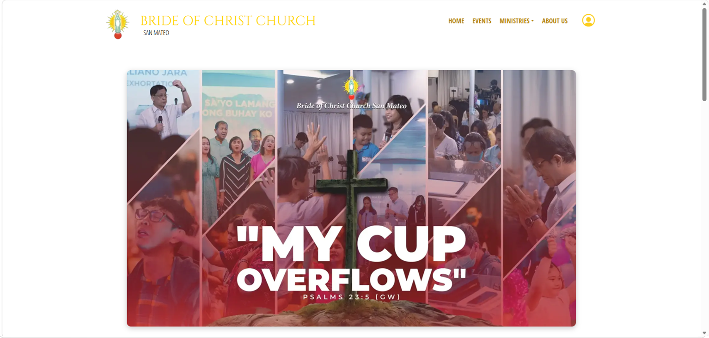
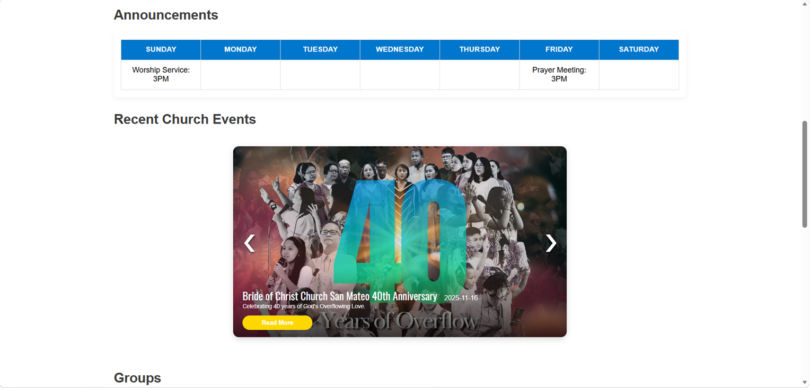
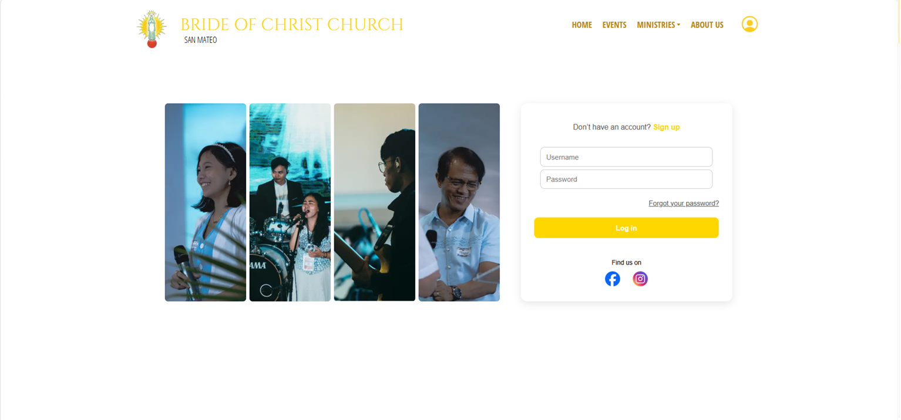
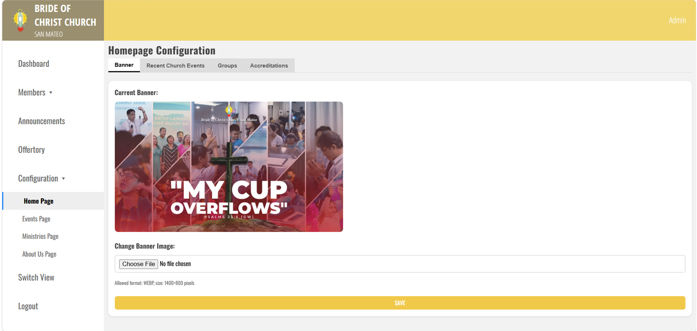
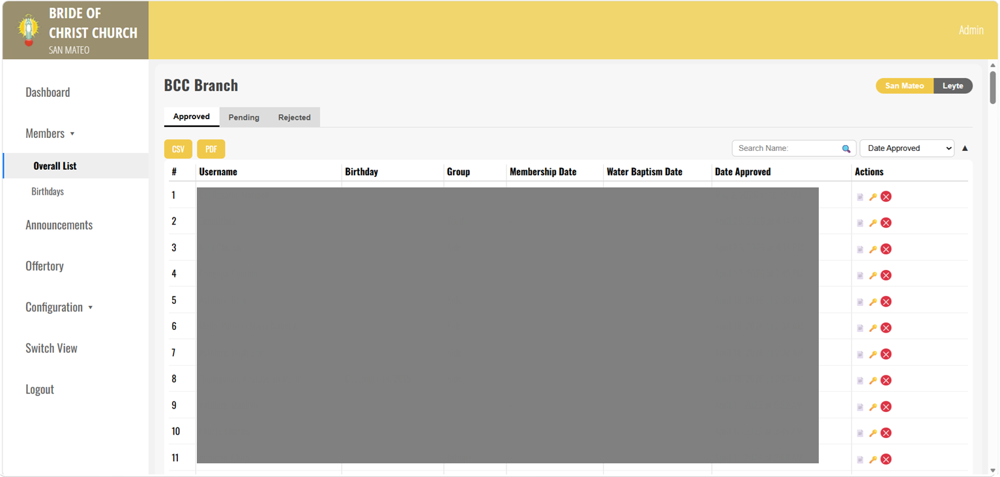
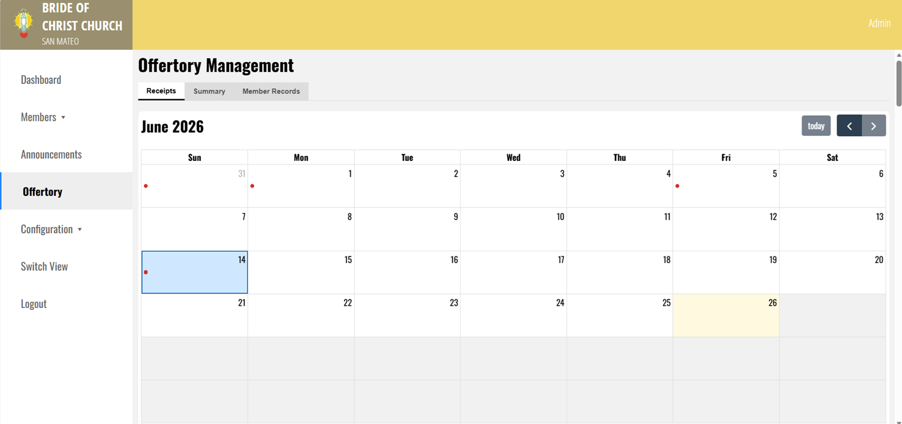

# BCCSM Church Management System
A web-based church management system developed for Bride of Christ Church San Mateo. The system supports church announcements, member and ministry records, administrative management, and offertory records.

## Features
- Admin login and access control
- Announcement and church information management
- Member and ministry record management
- Offertory recording and tracking
- Contribution reports and exports
- Administrative and finance record management

## Technologies Used

- HTML
- CSS
- JavaScript
- PHP
- MySQL

## My Role

I developed the system features, database-backed modules, admin functions, and reporting tools as a freelance web developer.

## Project Status

Ongoing development.

## Security and Privacy Note

This repository does not include private church records, real member information, real financial data, uploaded documents, or production database credentials.

## Screenshots

### Homepage Banner

### Homepage Announcements and Events

### Login Page

### Admin Configuration

### Member Management

### Offertory Management

